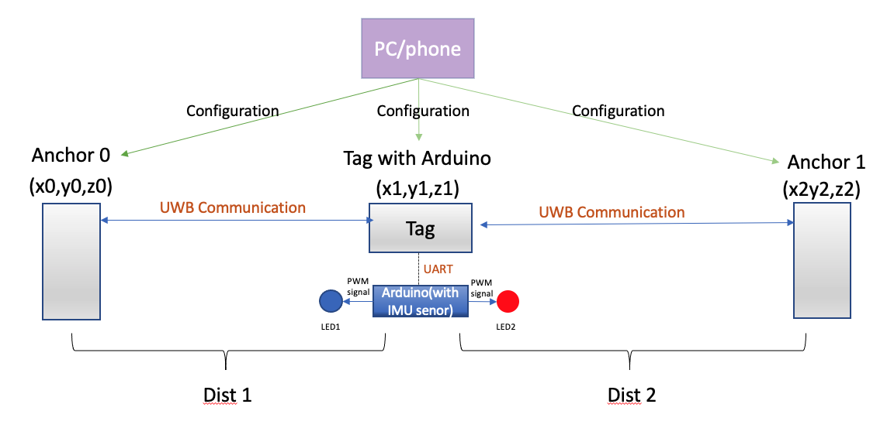
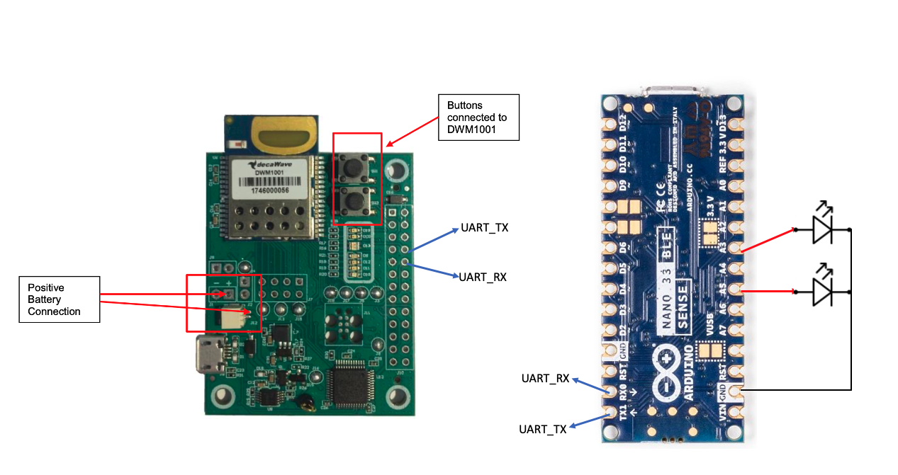
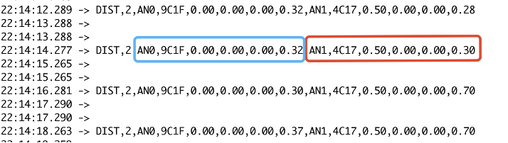
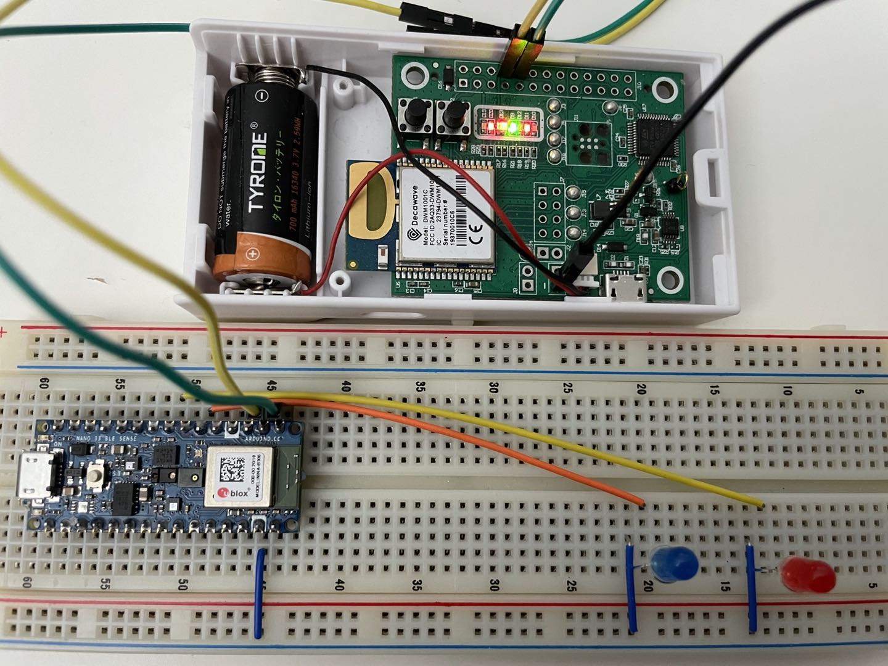
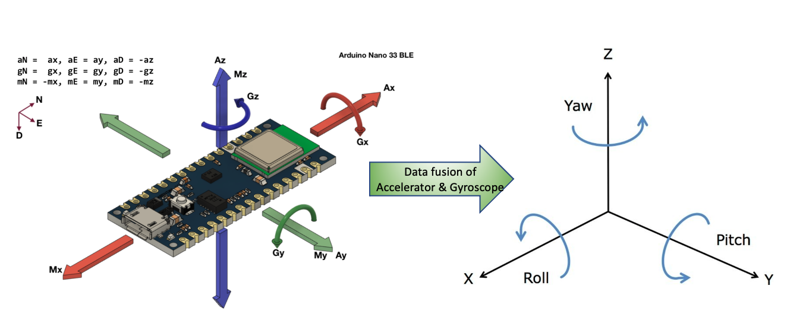

[< Back to main page](../README.md)

# Fianl Report
#### ECE M202A Project: UWB Indoor Positioning - Select & Control
Contribute: Jiacheng Liu, Yibo Wang

--------------------------------------------------------------------------------------------

### System components: 
 1. **Decawave DWM 1001 units:** We use the Decawave MDEK1001 Development Kit as our positioning tool. The Kit includes 12 RTLS units (DWM1001)  and we use several of the DWM1001 to be anchors and use 1 RTLS unit to be a tag. This system will measure the distance of all anchors to this specific tag.
 2. **J-Link driver & Terminal in Mac OS/Android App:** The J-Link is a driver to make DWM1001 can be configured on the computer. Terminal/Android App is the interface to configure the basic information of tag and anchors. The basic information includes the initial position of anchors, UWB states, and update rate.
 3. **Arduino Nano 33 BLE sense:** We use Arduino to communicate with DWM1001 through the serial port to obtain the real-time position information of the anchors. Then we use Arduino to perform calculations to determine our choice in order to turn on or off the corresponding LEDs.
 4. **LEDs:** the function of the breadboard and LED is to visualize the results of our data analysis and calculations.

   <p align="center">
    
  </p>
  
  Our project is mainly divided into two parts. The first part is the implementation of  UART communication between Tag and Arudino. And the second part is using a built-in IMU sensor of Arduino to do the gesture control.

--------------------------------------------------------------------------------------------
### Part I: UART Communication between Tag and Arduino
   **Implementation procedures:**
   1. Doing the configuration of Tag and Anchors using Terminal/Andriod app.
   2. Using terminal with specific commands to observe the data format.
   3. Coding on Arduino to obtain and process data, and then use the processed data to do some calculations to achieve our selection function.
   4. Using a breadboard to build a simple circuit to visualize the results.

   **Schematic diagram:**
   <p align="center">
      
   </p>

  #### Technical Approach:
  1. **Configure the Anchors and Tag in terminal** <br />
      Find the name of the serial port and then use the screen to connect to the serial

      ```
      ls /dev/cu.*
      screen /dev/tty.usbmodem14331 115200
      ```
      Then using the Decawave API firmware API Guide: <a target="_blank" rel="noopener noreferrer" href="https://www.decawave.com/sites/default/files/dwm1001-api-guide.pdf" >DWM1001 FIRMWARE API GUIDE</a> to find the commands to configure the Anchors and Tag.

  2. **Using Arduino to control the Tag to get the data**<br />
      Press Enter twice to get into the shell mode and enter ‘lec’ to get the position data.
      
      ```
      Serial1.write(0x0D); // send the first "Enter" to get into SHELL Mode
      Serial1.write(0x0D); // send the second "Enter" to get into SHELL Mode
      
      Serial1.write(0x6C); //send "l"
      Serial1.write(0x65); //send "e"
      Serial1.write(0x63); //send "c"
      Serial1.write(0x0D); //send "Enter"
      ```
      Process the acquired position data and separate the string of data to obtain the distance between the two Anchors and the Tag.

      Data format:
      <p align="center">
        
      </p>

      ```
      DataStr = Serial1.readStringUntil(0x0D);
      DataStr.toCharArray(DataBuffer, MAX_STR_LEN);  
      Data_Decode(DataBuffer,delim,&Header,&Num,&ID1,&Addr1,&x1,&y,&z1,&Dis1,&ID2,&Addr2,&x2,&y2,&z2,&Dis2);
      ```
  3. **Using PWM to control the LEDs**<br />
      If the Tag is moving from Anchor0 to Anchor1, the left LED will turn on, and vice versa. The two LEDs on the left and right reflect the moving direction of the tag, which is our selection.
      
      The connection between Tag, Arduino, and LEDs. When we want to choose a direction, we only need to move the entire connected device to the left or right, the LED light will turn on or off according to the direction of movement.


      <p align="center">
        
      </p>

--------------------------------------------------------------------------------------------
### Part II:  Using a Built-in IMU Sensor of Arduino to Do the Gesture Control.

**Implementation procedures:**
  1. Finding the IMU and Data fusion libraries and including them in the Arduino.
  2. Implementing the MadgwickAHRS algorithm (Data fusion) to get the orientation of the based on accelerometer and gyroscope readings.
  3. Through turning the Arduino, the Roll will change, and this will change the brightness of the LEDs after we select a direction. 

**The way to get the Pitch, Roll, and Yaw**<br />
      <p align="center">
        
      </p>

#### Technical Approach:
  1. **Including the required libraries**<br />

      ```
      #include <MadgwickAHRS.h>
      #include <Arduino_LSM9DS1.h> 
      ```

  2. **Instantiating a filter and do the data fusion by getting the values of Accelerator and Gyroscope.**<br />

      ```
      Madgwick filter;

      if (IMU.accelerationAvailable()) 
      {
            IMU.readAcceleration(accel_x, accel_y, accel_z);
      }
      if (IMU.gyroscopeAvailable()) 
      {
            IMU.readGyroscope(gyro_x, gyro_y, gyro_z);
      }
      filter.updateIMU(gyro_x, gyro_y, gyro_z, accel_x,  accel_y, accel_z);
      roll = filter.getRoll(); 
      pitch = filter.getPitch();  
      yaw = filter.getYaw();
      ```
  3. **Controlling the brightness of LEDs by changing the Roll of Arduino.**<br />

      ```
      analogWrite(LED_AN0, 30+roll/2);
      analogWrite(LED_AN1, 30+roll/2); 
      ```
      


[< Back to main page](../README.md)